# SupportNova - Entity-Relationship Diagram

**54 tables**, PostgreSQL (Supabase) in production. Generated from the SQLAlchemy
metadata in `backend/src/db/models` (the same metadata `schema.sql` is compiled from);
Alembic (`backend/alembic`, head `0004_email_messages`) remains the source of truth.

How to read the diagrams

* One Mermaid `erDiagram` per domain; every column of the domain's tables is listed
  with its PostgreSQL type (`varchar64` = `VARCHAR(64)`, `vector768` = pgvector
  `VECTOR(768)`), and `PK` / `FK` / `UK` (single-column unique) markers.
  `"not null"` marks mandatory columns.
* Tables from another domain appear with their primary key only, so each diagram
  shows how its domain attaches to the rest.
* `||--o{` = mandatory parent, `|o--o{` = optional parent (nullable foreign key).
  The label is the foreign-key column.
* Foreign keys to `users` (`created_by`, `uploaded_by`, `actor_id`, `assigned_to` ...)
  are marked `FK` in the column lists but only drawn in diagram A, to keep the other
  diagrams legible.
* Status and outcome columns are `text` + `CHECK` constraints (values in
  `src/db/enums.py`); business taxonomy lives in lookup tables (domain B).

## Contents

| Domain | Tables |
|---|---|
| A - Identity, access and audit | `users`, `refresh_tokens`, `audit_log` |
| B - Taxonomy and runtime configuration | `departments`, `categories`, `subcategories`, `priority_levels`, `escalation_levels`, `sla_policies`, `app_config` |
| C - Deterministic signal configuration | `lexicon_terms`, `injection_patterns`, `promise_patterns` |
| D - Knowledge base | `documents`, `document_versions`, `document_sections`, `chunks` |
| E - Rule matrix | `rules` |
| F - Customers and complaints | `customers`, `complaints`, `complaint_entities`, `complaint_links`, `complaint_status_history`, `complaint_attachments` |
| G - Complaint-intelligence detail | `complaint_policy_refs`, `resolution_steps`, `eligibility_decisions`, `clarification_questions`, `agent_guidance` |
| H - Intake validation findings | `complaint_validation_issues`, `document_validation_issues` |
| I - Pipelines (GenAI and Python) | `prompt_versions`, `llm_cache`, `genai_runs`, `validation_runs`, `rule_hits` |
| J - Verification | `comparisons`, `verification_decisions` |
| K - Workflow | `responses`, `response_flags`, `escalations`, `follow_ups`, `review_queue`, `review_actions`, `sla_events` |
| L - Security, operations and reporting | `injection_events`, `jobs`, `benchmark_runs`, `benchmark_results`, `impact_analyses`, `impact_items`, `report_exports`, `trend_snapshots` |
| M - E-mail channel | `email_messages` |

## Overview - the dual-pipeline core

Relationships only. A complaint is analysed independently by Pipeline 1
(`genai_runs`, one row per attempt) and Pipeline 2 (`validation_runs` + `rule_hits`);
`comparisons` and `verification_decisions` reconcile the two; every policy reference
resolves through `complaint_policy_refs` to a `chunks` row of a `document_versions` row.
`prompt_versions` is linked to `genai_runs` by name + version (no foreign key).

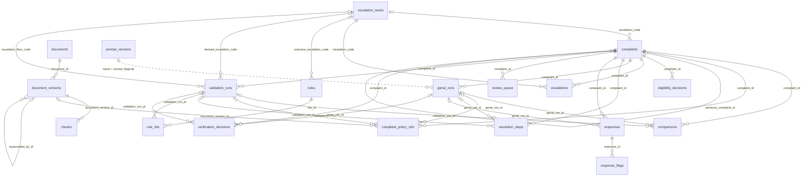

## A - Identity, access and audit

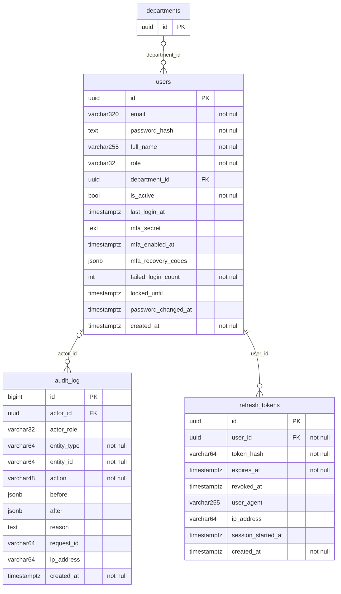

## B - Taxonomy and runtime configuration

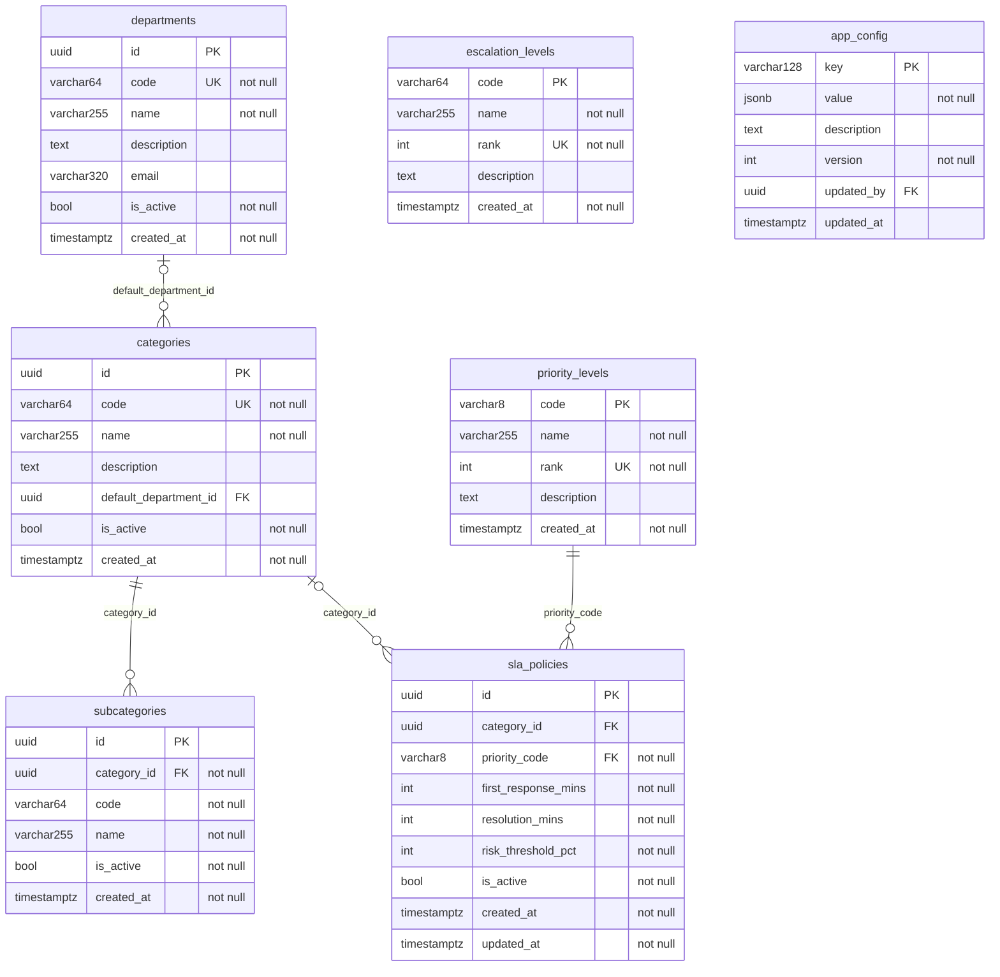

## C - Deterministic signal configuration

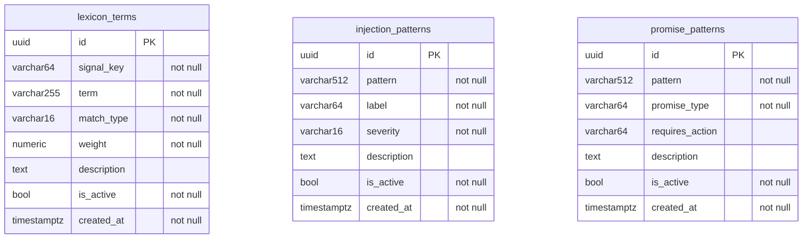

## D - Knowledge base

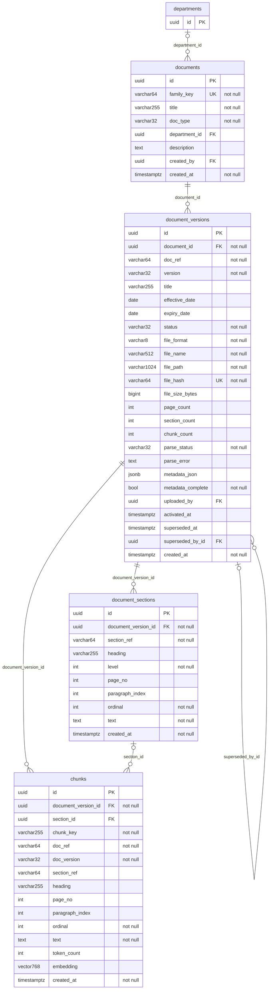

## E - Rule matrix

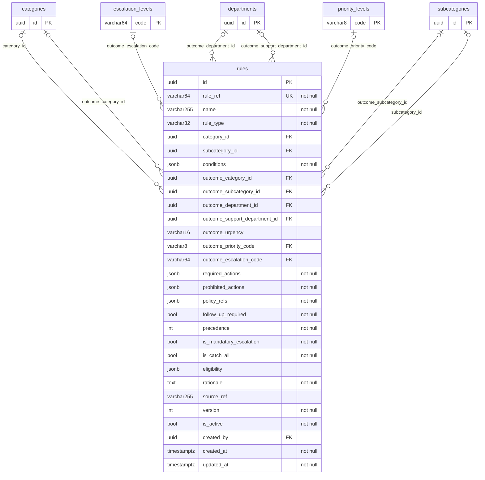

## F - Customers and complaints

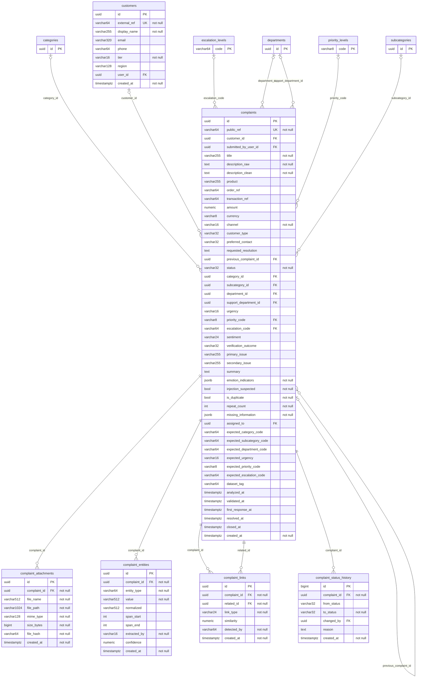

## G - Complaint-intelligence detail

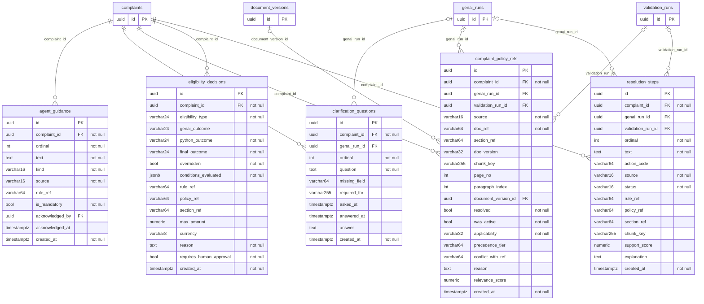

## H - Intake validation findings

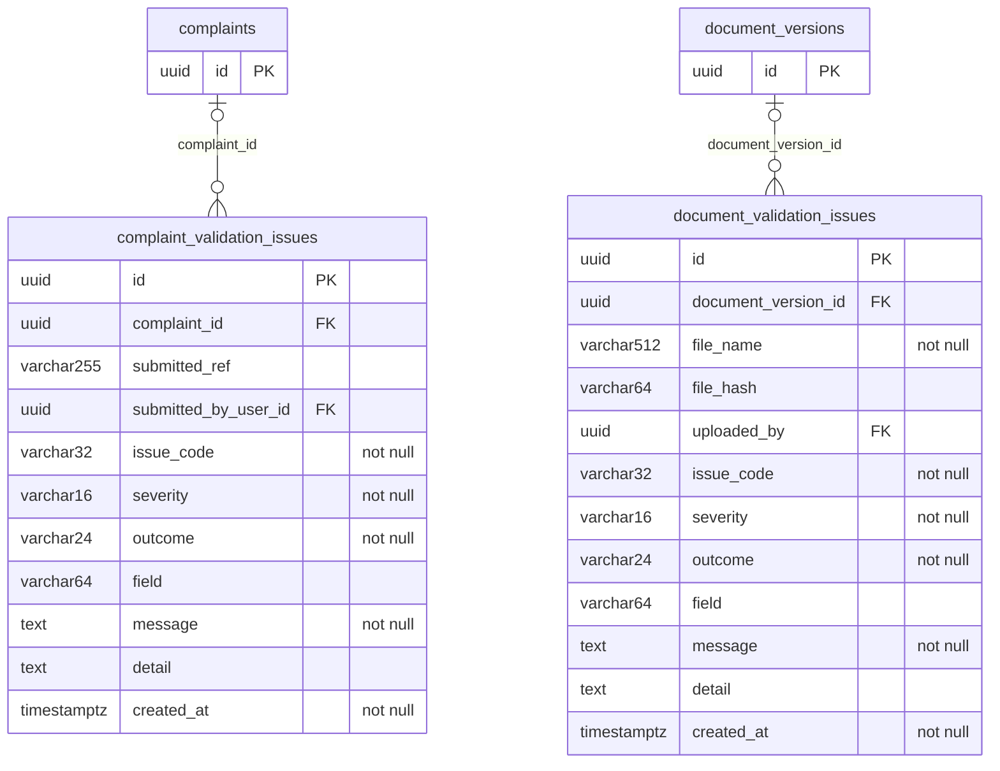

## I - Pipelines (GenAI and Python)

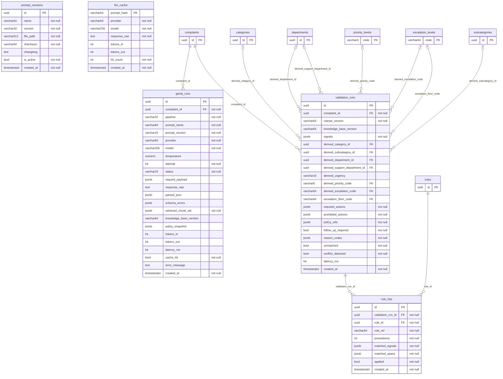

## J - Verification

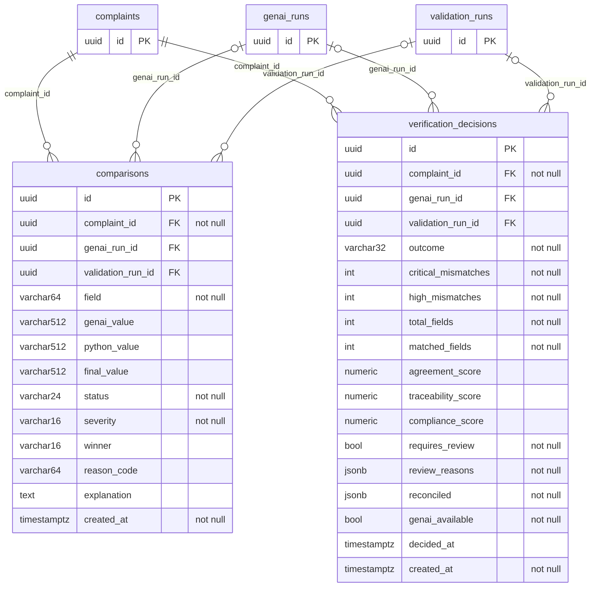

## K - Workflow

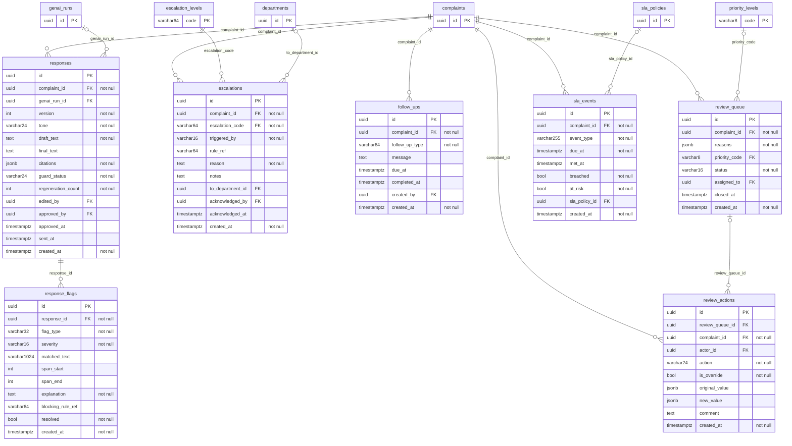

## L - Security, operations and reporting

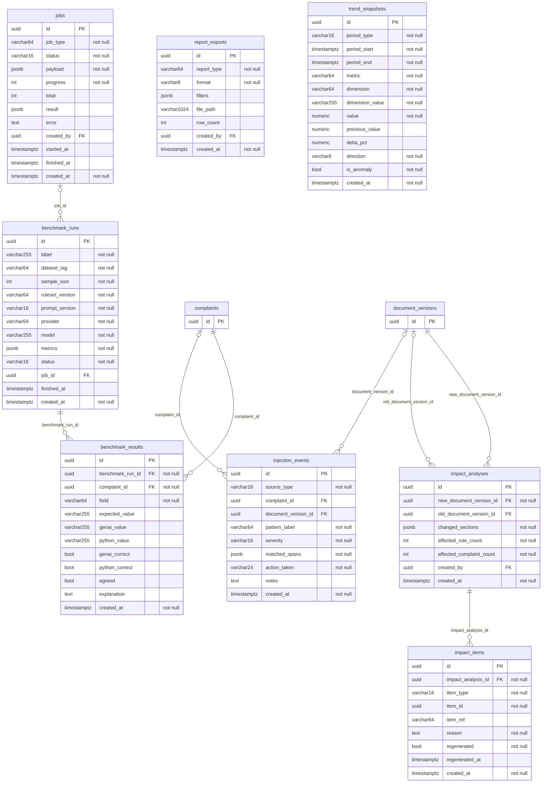

## M - E-mail channel

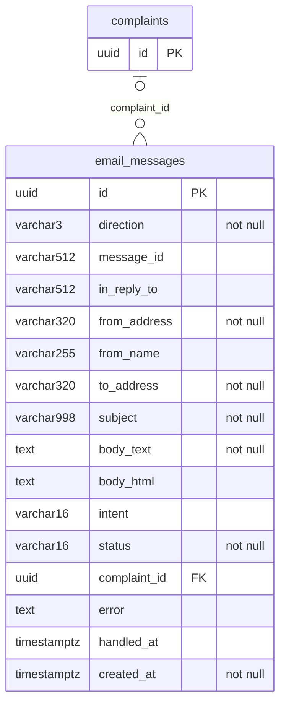

## Table-by-table description

Row counts are a read-only snapshot of the production database taken on 27 September 2026;
they change as the system is used.

### A - Identity, access and audit

- **`users`** (15 columns, PK `id`, 40 rows). Login accounts for staff and customers: e-mail (unique, case-insensitive via `ux_users_email_lower`), password hash, role (`customer`, `agent`, `reviewer`, `manager`, `admin`, `evaluator`), optional department, and the two-step sign-in / lockout columns added by migration 0003.
  Foreign keys: `department_id -> departments`.
- **`refresh_tokens`** (9 columns, PK `id`, 842 rows). Refresh tokens stored only as SHA-256 hashes and rotated on every use, so a replayed token fails. Carries the session start time across rotations.
  Foreign keys: `user_id -> users`.
- **`audit_log`** (12 columns, PK `id`, 301 rows). Append-only audit trail: actor, entity, action, `before`/`after` JSON, reason and request id. The application role is not granted UPDATE/DELETE on it in production.
  Foreign keys: `actor_id -> users`.

### B - Taxonomy and runtime configuration

- **`departments`** (7 columns, PK `id`, 14 rows). Responsible departments, i.e. routing targets. Stored as data so a department can be added at runtime.
- **`categories`** (7 columns, PK `id`, 13 rows). Configurable complaint categories, each with an optional default department.
  Foreign keys: `default_department_id -> departments`.
- **`subcategories`** (6 columns, PK `id`, 68 rows). Subcategories scoped to a category (`uq_subcat_category_code`).
  Foreign keys: `category_id -> categories`.
- **`priority_levels`** (5 columns, PK `code`, 4 rows). Ordered priority ladder P0-P3 keyed by `code`. `rank` 0 is the most severe, which turns "Python may raise but never lower" into a rank comparison.
- **`escalation_levels`** (5 columns, PK `code`, 6 rows). Ordered escalation ladder (NONE up to CRITICAL_MGMT) keyed by `code`. `rank` is what the mandatory escalation floor is compared on.
- **`sla_policies`** (9 columns, PK `id`, 17 rows). First-response and resolution targets per category x priority, with an at-risk percentage threshold.
  Foreign keys: `category_id -> categories`; `priority_code -> priority_levels`.
- **`app_config`** (6 columns, PK `key`, 12 rows). Key -> JSON runtime configuration: policy precedence order, comparison severity weights, thresholds, ruleset version, organisation profile.
  Foreign keys: `updated_by -> users`.

### C - Deterministic signal configuration

- **`lexicon_terms`** (8 columns, PK `id`, 1,451 rows). Phrases, words and regular expressions mapped to named signals (`signal_key`) that rule conditions test. Signals marked analytics-only (e.g. `emotional_intensity`) are recorded but never reach the rule engine.
- **`injection_patterns`** (7 columns, PK `id`, 76 rows). Prompt-injection detection patterns with a label (INSTRUCTION_OVERRIDE, ROLE_HIJACK, ...) and severity.
- **`promise_patterns`** (7 columns, PK `id`, 19 rows). Phrases that amount to a promise (refund, compensation, timeline, exception ...) and the eligibility type each one requires before it may reach a customer.

### D - Knowledge base

- **`documents`** (8 columns, PK `id`, 29 rows). A policy family: the logical document across all of its versions, with type and owning department.
  Foreign keys: `created_by -> users`; `department_id -> departments`.
- **`document_versions`** (25 columns, PK `id`, 29 rows). One uploaded file per version with status (ACTIVE, SUPERSEDED, EXPIRED, DRAFT, METADATA_REVIEW), effective/expiry dates, file metadata and parse status. The partial unique index `ux_docver_one_active` guarantees at most one ACTIVE version per document.
  Foreign keys: `document_id -> documents`; `superseded_by_id -> document_versions`; `uploaded_by -> users`.
- **`document_sections`** (10 columns, PK `id`, 129 rows). Numbered or headed sections of a version, located by page (PDF) or paragraph index (DOCX).
  Foreign keys: `document_version_id -> document_versions`.
- **`chunks`** (15 columns, PK `id`, 129 rows). Retrieval units. `chunk_key` (e.g. `DEL-POL-04::6::c1`) is the token the model must cite; doc_ref, version, section, page and paragraph are denormalised for traceability. Holds the 768-dimension embedding and a full-text index.
  Foreign keys: `document_version_id -> document_versions`; `section_id -> document_sections`.

### E - Rule matrix

- **`rules`** (29 columns, PK `id`, 728 rows). The Complaint Resolution Rule Matrix: a JSON condition DSL (interpreted, never eval-ed), outcome columns (category, department, urgency, priority, escalation), required and prohibited actions, policy references, precedence, and the `is_mandatory_escalation`, `is_catch_all` and `eligibility` control columns.
  Foreign keys: `category_id -> categories`; `created_by -> users`; `outcome_category_id -> categories`; `outcome_department_id -> departments`; `outcome_escalation_code -> escalation_levels`; `outcome_priority_code -> priority_levels`; `outcome_subcategory_id -> subcategories`; `outcome_support_department_id -> departments`; `subcategory_id -> subcategories`.

### F - Customers and complaints

- **`customers`** (9 columns, PK `id`, 10 rows). Records about the person who complained (synthetic data only). Separate from `users`; `user_id` is optional.
  Foreign keys: `user_id -> users`.
- **`complaints`** (49 columns, PK `id`, 558 rows). The central record: raw and cleaned text, order/transaction references, the reconciled classification (category, department, urgency, priority, escalation, verification outcome), flags, the `expected_*` benchmark labels (never read by either pipeline) and lifecycle timestamps.
  Foreign keys: `assigned_to -> users`; `category_id -> categories`; `customer_id -> customers`; `department_id -> departments`; `escalation_code -> escalation_levels`; `previous_complaint_id -> complaints`; `priority_code -> priority_levels`; `subcategory_id -> subcategories`; `submitted_by_user_id -> users`; `support_department_id -> departments`.
- **`complaint_entities`** (10 columns, PK `id`, 921 rows). Extracted entities (order id, amount, date ...) with character spans and which pipeline extracted them.
  Foreign keys: `complaint_id -> complaints`.
- **`complaint_links`** (7 columns, PK `id`, 26 rows). Exact-duplicate, near-duplicate and repeat relationships with similarity score and detector (TRIGRAM, EMBEDDING, REFERENCE).
  Foreign keys: `complaint_id -> complaints`; `related_id -> complaints`.
- **`complaint_status_history`** (7 columns, PK `id`, 1,385 rows). Every lifecycle transition: from/to status, who changed it and why.
  Foreign keys: `changed_by -> users`; `complaint_id -> complaints`.
- **`complaint_attachments`** (8 columns, PK `id`, 4 rows). Attachment metadata: file name, path, MIME type, size and hash.
  Foreign keys: `complaint_id -> complaints`.

### G - Complaint-intelligence detail

- **`complaint_policy_refs`** (20 columns, PK `id`, 1,332 rows). Every policy reference that touches a complaint (cited by GenAI, required by a rule, or surfaced by retrieval) with its verdict: resolved, was_active, applicability, precedence tier and `conflict_with_ref`. The table the Source-Traceability Challenge is answered from.
  Foreign keys: `complaint_id -> complaints`; `document_version_id -> document_versions`; `genai_run_id -> genai_runs`; `validation_run_id -> validation_runs`.
- **`resolution_steps`** (16 columns, PK `id`, 2,228 rows). Recommended resolution steps from either pipeline with a Python verdict: SUPPORTED, UNSUPPORTED, PROHIBITED, MISSING or REQUIRED_MET.
  Foreign keys: `complaint_id -> complaints`; `genai_run_id -> genai_runs`; `validation_run_id -> validation_runs`.
- **`eligibility_decisions`** (16 columns, PK `id`, 626 rows). Refund / replacement / compensation eligibility: GenAI opinion, Python outcome and the final (deterministic) outcome, conditions evaluated and any amount ceiling.
  Foreign keys: `complaint_id -> complaints`.
- **`clarification_questions`** (11 columns, PK `id`, 105 rows). Focused questions asked when information is missing, instead of inventing facts.
  Foreign keys: `complaint_id -> complaints`; `genai_run_id -> genai_runs`.
- **`agent_guidance`** (11 columns, PK `id`, 1,802 rows). Internal guidance for the agent, from GenAI and from the rules; rule-sourced CAUTION items are mandatory.
  Foreign keys: `acknowledged_by -> users`; `complaint_id -> complaints`.

### H - Intake validation findings

- **`complaint_validation_issues`** (11 columns, PK `id`, 19 rows). Intake findings for submitted complaints (TOO_SHORT, DUPLICATE_COMPLAINT, INVALID_REFERENCE_ID, SUSPECTED_INJECTION ...) with severity and outcome.
  Foreign keys: `complaint_id -> complaints`; `submitted_by_user_id -> users`.
- **`document_validation_issues`** (12 columns, PK `id`, 3 rows). Intake findings for uploaded documents (unsupported type, oversized, missing version or effective date ...).
  Foreign keys: `document_version_id -> document_versions`; `uploaded_by -> users`.

### I - Pipelines (GenAI and Python)

- **`prompt_versions`** (8 columns, PK `id`, 5 rows). Registry of versioned prompt templates (`prompt_templates/<name>/vX.Y.j2`) with a SHA-256 checksum; `ux_prompt_one_active` allows one active version per prompt name.
- **`llm_cache`** (8 columns, PK `prompt_hash`, 506 rows). Prompt hash -> real captured provider response, used for development cost control and as an outage replay. Never written by anything but a real provider call.
- **`genai_runs`** (23 columns, PK `id`, 704 rows). One row per GenAI attempt (retries are extra rows): pipeline, prompt name and version, provider, model, temperature, status, request payload, raw response, parsed JSON, schema errors, retrieved chunk keys, policy snapshot, tokens, latency, cache flag and error message.
  Foreign keys: `complaint_id -> complaints`.
- **`validation_runs`** (22 columns, PK `id`, 591 rows). Pipeline 2 output, produced without the GenAI result: deterministic signals, derived category/department/urgency/priority/escalation, the escalation floor, required and prohibited actions, reason codes, and the `unmatched` / `conflict_detected` flags.
  Foreign keys: `complaint_id -> complaints`; `derived_category_id -> categories`; `derived_department_id -> departments`; `derived_escalation_code -> escalation_levels`; `derived_priority_code -> priority_levels`; `derived_subcategory_id -> subcategories`; `derived_support_department_id -> departments`; `escalation_floor_code -> escalation_levels`.
- **`rule_hits`** (9 columns, PK `id`, 3,405 rows). Which rules fired in a validation run, with the matched signals and text spans; `applied = false` for a rule that matched but lost on precedence.
  Foreign keys: `rule_id -> rules`; `validation_run_id -> validation_runs`.

### J - Verification

- **`comparisons`** (14 columns, PK `id`, 5,542 rows). One row per compared field per complaint: GenAI value, Python value, final value, status, severity, winner, reason code and a plain-English explanation.
  Foreign keys: `complaint_id -> complaints`; `genai_run_id -> genai_runs`; `validation_run_id -> validation_runs`.
- **`verification_decisions`** (18 columns, PK `id`, 591 rows). The reconciled verdict per complaint: outcome, critical/high mismatch counts, agreement, traceability and compliance scores, review reasons and the reconciled record.
  Foreign keys: `complaint_id -> complaints`; `genai_run_id -> genai_runs`; `validation_run_id -> validation_runs`.

### K - Workflow

- **`responses`** (15 columns, PK `id`, 10 rows). Versioned customer-reply drafts with tone, citations, guard status and regeneration count.
  Foreign keys: `approved_by -> users`; `complaint_id -> complaints`; `edited_by -> users`; `genai_run_id -> genai_runs`.
- **`response_flags`** (11 columns, PK `id`, 10 rows). Response-guard findings (UNSUPPORTED_PROMISE, HALLUCINATION, INVALID_CITATION ...) with character span, explanation and blocking rule.
  Foreign keys: `response_id -> responses`.
- **`escalations`** (11 columns, PK `id`, 300 rows). Escalation records: level, trigger (PYTHON_RULE, GENAI, REVIEWER, SLA), rule, reason and the generated handover note.
  Foreign keys: `acknowledged_by -> users`; `complaint_id -> complaints`; `escalation_code -> escalation_levels`; `to_department_id -> departments`.
- **`follow_ups`** (8 columns, PK `id`, 491 rows). Scheduled follow-up actions with due and completion times.
  Foreign keys: `complaint_id -> complaints`; `created_by -> users`.
- **`review_queue`** (8 columns, PK `id`, 532 rows). Manual review queue items with entry reasons, priority, status and assignee.
  Foreign keys: `assigned_to -> users`; `complaint_id -> complaints`; `priority_code -> priority_levels`.
- **`review_actions`** (10 columns, PK `id`, 3 rows). Reviewer decisions, keeping both `original_value` and `new_value` (`is_override`).
  Foreign keys: `actor_id -> users`; `complaint_id -> complaints`; `review_queue_id -> review_queue`.
- **`sla_events`** (9 columns, PK `id`, 1,086 rows). SLA clocks (first response, resolution) with due, met, breached and at-risk flags.
  Foreign keys: `complaint_id -> complaints`; `sla_policy_id -> sla_policies`.

### L - Security, operations and reporting

- **`injection_events`** (10 columns, PK `id`, 82 rows). Every prompt-injection detection on complaints and documents, with matched spans and the action taken.
  Foreign keys: `complaint_id -> complaints`; `document_version_id -> document_versions`.
- **`jobs`** (12 columns, PK `id`, 0 rows). Database-backed background job queue with progress; no external broker.
  Foreign keys: `created_by -> users`.
- **`benchmark_runs`** (13 columns, PK `id`, 4 rows). Batch evaluation runs over the labelled dataset with headline metrics (including mandatory escalation recall).
  Foreign keys: `job_id -> jobs`.
- **`benchmark_results`** (12 columns, PK `id`, 3,030 rows). One field of one complaint in one benchmark run: expected, GenAI and Python values and whether each was correct.
  Foreign keys: `benchmark_run_id -> benchmark_runs`; `complaint_id -> complaints`.
- **`impact_analyses`** (8 columns, PK `id`, 0 rows). Impact analysis when a policy version is replaced (changed sections, affected rules and complaints).
  Foreign keys: `created_by -> users`; `new_document_version_id -> document_versions`; `old_document_version_id -> document_versions`.
- **`impact_items`** (9 columns, PK `id`, 0 rows). Complaints, rules or responses affected by a policy change, and whether each was regenerated.
  Foreign keys: `impact_analysis_id -> impact_analyses`.
- **`report_exports`** (8 columns, PK `id`, 1 rows). Record of every report export: type, format, filters, row count and who exported it.
  Foreign keys: `created_by -> users`.
- **`trend_snapshots`** (13 columns, PK `id`, 0 rows). Rolling period aggregates per metric and dimension with delta, direction and anomaly flag.

### M - E-mail channel

- **`email_messages`** (16 columns, PK `id`, 25 rows). Every message received at or sent from the support mailbox (both directions), linked to a complaint where one exists. Added by migration 0004.
  Foreign keys: `complaint_id -> complaints`.

